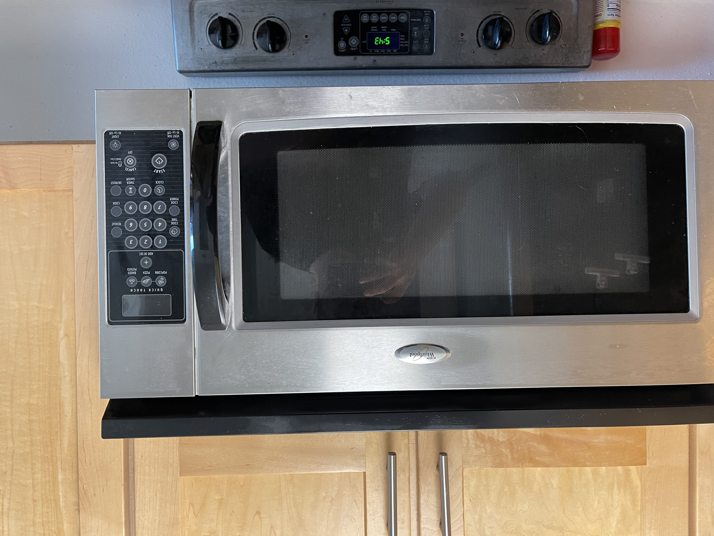
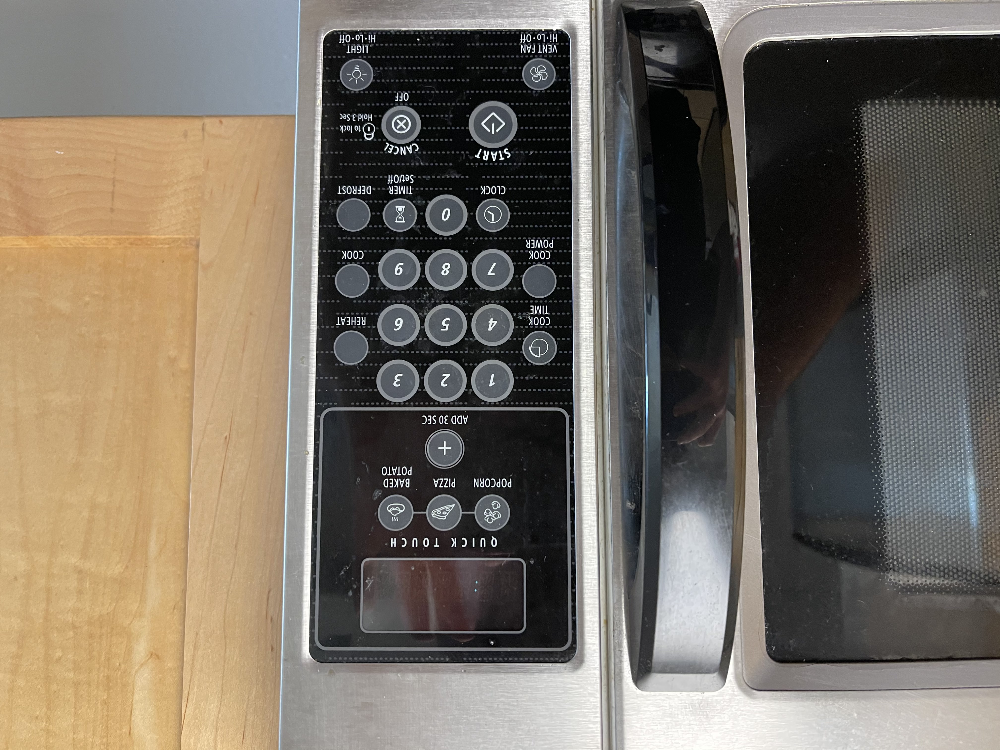

# Project 1 Report

## Design Flaws in Example
1. Quick Touch Buttons  
  In this microwave the "quick touch" buttons are a little more toublesome than they are worth with the exception of the "add 30 sec" button that can be used to add thirty seconds to and existing or new time on the timer. Otherwise, there are only three options: popcorn, pizza, and baked potato. These three buttons are not helpful in a more common setting as they are not necesarilly the most common cooked microwave foods in the household. Additionally, the popcorn button is almost never completely accurate on microwaves as popcorn times vary by brand. Instead, this "feature" could be removed all together or be replaced with a menu in order to serve more options to the end user. 
2. Reheat, Cook, and Defrost Buttons  
  Each of these buttons causes a menu subroutine to begin within the seven-segment display interface. The unfortunate part is that this menu is not ckear and is difficult to utilize as there are no instructions on how to navigate it. 
3. Start and Cancel Buttons  
  The start button is vague other than its labeling. The particular symbol used is one that means toggle. A symbol with both a closed and open circuit is to be used for toggling the operation of a device when in actuality the button only starts the microwave. The cancel button is more clear but not perfect as it labels both "cancel" and "off". Despite many attempts, I was unable to make this button acutally power down the device.
4. Locking Ability  
  While the locking ability is seemingly self explanatory, it may not be for some. Does it lock the device in the current running state or compmletely disable the device from being used?
5. Cook Time and Cook Power Buttons  
  The cook power button is one that is extremely important for a microwave as different items require different power levels. The easy location of this button is something that can be praised. However, the cook time button is very poorly designed in my opinion because it is extremely vague. In normal use the numeric entry pad is used for determining how long one might want to cook something in the microwave so it is not very clear at all what the purpose of this button is.

## GIF of Operation

## Example Device Images

## Part B Questions
- Common Uses  
  - Timed cooking
  - Popcorn button usage
  - Quick meals such as ramen or small pasta dishes
- Rarer Uses
  - Defrosting - It is preferred to place whatever is needing to be defrosted in the sink or in a bowl of warm water
  - Food cooking options - Not used very often as most things tell you how long to cook them for
- How does the microwave support the user figure out how to make it work?
  - This particular model does not do a very good job at all of describing the instructions needed to preform an action within the interface. Especially in the cook and defrost interfaces
- How does the microwave provide feedback to the user?
  - Via the seven segment display. However, the issue with this method of feedback is that the display commonly uses abbreviations that may be unclear to the user
  - The device also outputs an identical beep for every button pressed to tell the user that a button was pressed
- What are some common mistakes you can make with this current design?
  - Not properly cooking your food by using the cook time button or by using the cook button
  - Some microwaves use the number pad as a method of starting the microwave for the corresponding number of minutes to cook an item while others use it as a way to enter the time to cook and then press the start button.  
- Suggest the improvements to make on the control interface. Also sketch. To impove the current interface I could do the following:
  -  Convert the seven segment display to use a much larger digital display to have more dynamic screen content and positioning.
  -  The cook time button could be labeled more clearly to show what it does.
  -  The button panel could also be fitted with tactile braile in order to assist vision impaired people in microwave use. The device could also use an AI assisted voice in order to provide feedback to users that is enabled by default for the visually impaired.
  -  Sketch:
   
